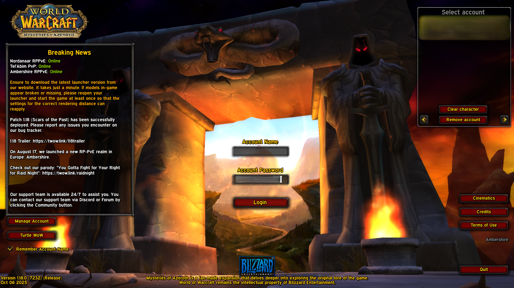
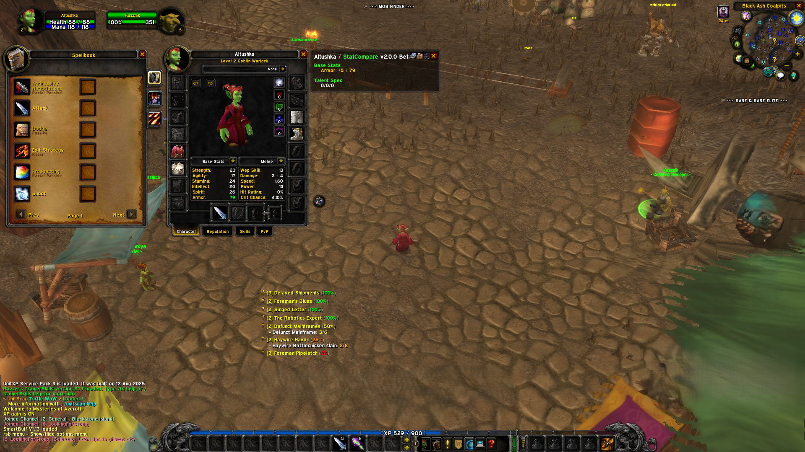

## Полное изменение шрифтов в игре на единый шрифт Expressway с полной поддержкой кириллицы.
1.  **Скачайте и разархивируйте** файл - https://github.com/whtmst/T-Fonts/raw/refs/heads/main/Fonts.rar
2.  Внутри вы увидите папку **`Fonts`** в которой 8 шрифтов.
3.  Скопируйте эту папку **`Fonts`** в **корневую директорию** вашего клиента Turtle WoW.
---
**ВАЖНО:** Папка `Fonts` должна лежать рядом с другими папками клиента:
```
[Корневая папка Turtle WoW]\
├── Cache
├── Data
├── Documentation
├── Errors
├── Fonts  <-- Ваша папка со шрифтами
├── Interface
├── Logs
└── ...
```
---
После этого все внутриигровые шрифты, включая кириллицу, заменятся на четкий и читаемый Expressway.



